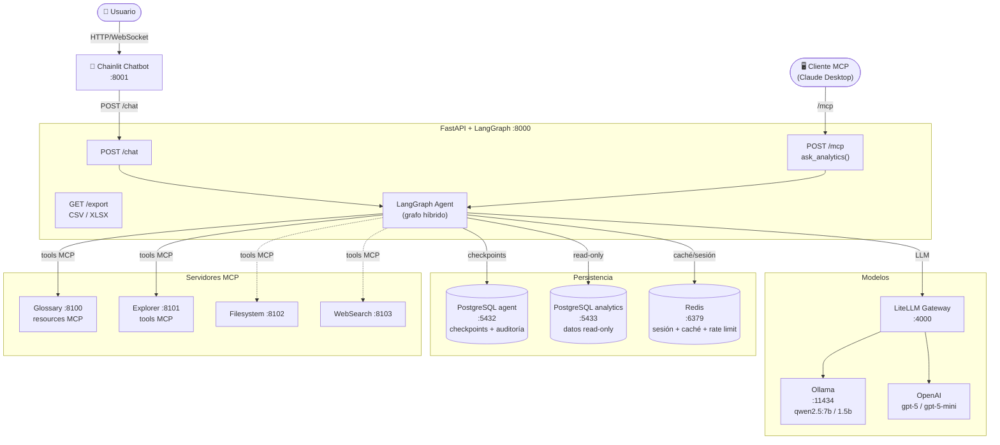
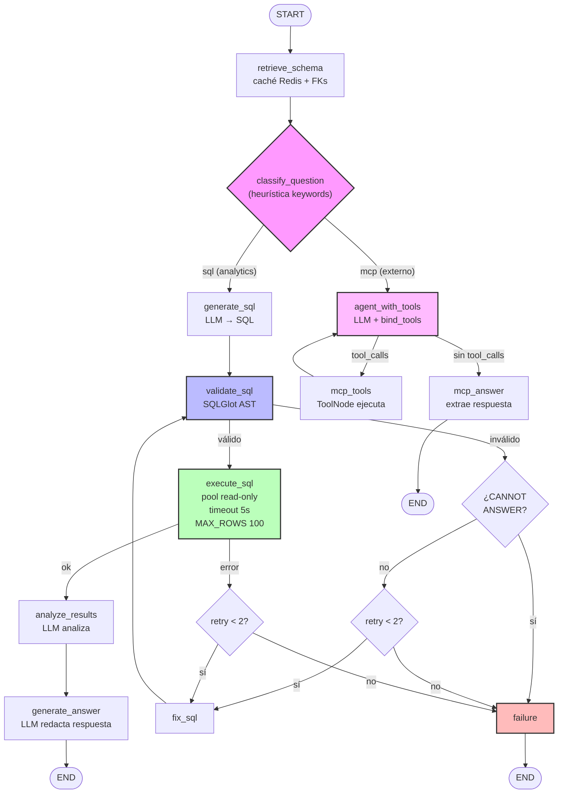
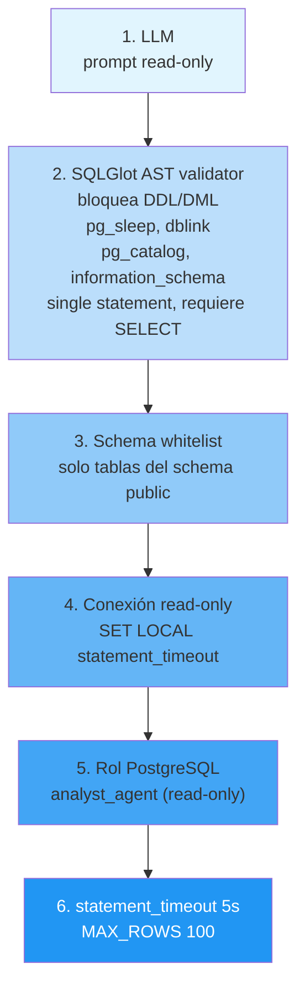
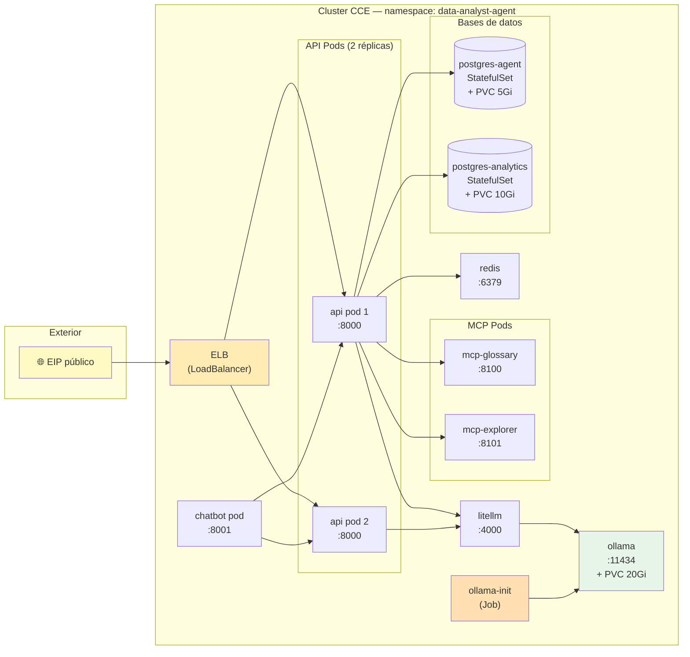
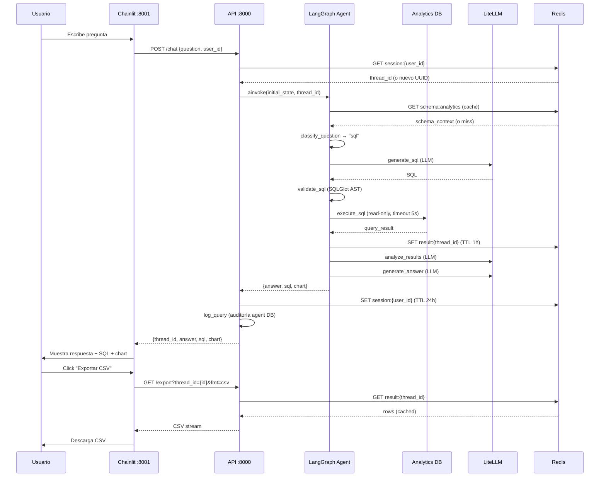

# Architecture — Data Analyst Agent

## Overview

```text
                          ┌──────────────────────┐
                          │       Usuario        │
                          └──────────┬───────────┘
                                     │ HTTP / WebSocket
                                     ▼
                          ┌──────────────────────┐         ┌──────────────────────┐
                          │   Chainlit Chatbot   │         │   Cliente MCP        │
                          │      (:8001)         │         │  (Claude Desktop)    │
                          └──────────┬───────────┘         └──────────┬───────────┘
                                     │ POST /chat                     │ /mcp
                                     ▼                                ▼
                          ┌──────────────────────────────────────────────────────┐
                          │              FastAPI + LangGraph (:8000)             │
                          │                                                      │
                          │  POST /chat   GET /export   POST /mcp (ask_analytics)│
                          │     │             │                   │              │
                          │     ▼             ▼                   ▼              │
                          │  ┌───────────────────────────────────────────────┐   │
                          │  │              LangGraph Agent                  │   │
                          │  │                                               │   │
                          │  │  retrieve_schema → classify_question          │   │
                          │  │                         │                     │   │
                          │  │              ┌──────────┴──────────┐          │   │
                          │  │              ▼                     ▼          │   │
                          │  │      Pipeline SQL             MCP loop        │   │
                          │  │      (determinista)       (agent_with_tools   │   │
                          │  │      validate AST          ↔ mcp_tools)       │   │
                          │  │      execute read-only           │            │   │
                          │  │      analyze                    ▼            │   │
                          │  │      answer                 answer           │   │
                          │  └───────────────────────────────────────────────┘   │
                          └──────┬──────────┬──────────┬──────────┬──────────────┘
                                 │          │          │          │
                                 ▼          ▼          ▼          ▼
                    ┌────────────┐  ┌────────────┐  ┌────────┐  ┌────────────────┐
                    │  LiteLLM   │  │ PostgreSQL │  │ Redis  │  │  MCP Servers   │
                    │  Gateway   │  │            │  │        │  │                │
                    │  (:4000)   │  │  agent DB  │  │ (:6379)│  │  glossary :8100│
                    │            │  │  analytics │  │        │  │  explorer :8101│
                    │ OpenAI     │  │  (:5432)   │  │ session│  │  filesystem    │
                    │ Ollama     │  │  (:5433)   │  │ cache  │  │  websearch     │
                    │            │  │            │  │ rate   │  │                │
                    │ gpt-5      │  │ checkpoints│  │ limit  │  │  (HTTP /mcp)   │
                    │ qwen2.5    │  │ auditoria  │  │        │  │                │
                    └─────┬──────┘  └────────────┘  └────────┘  └────────────────┘
                          │
                          ▼
                    ┌────────────┐
                    │   Ollama   │
                    │  (:11434)  │
                    │            │
                    │ qwen2.5:7b │
                    │ qwen2.5:1.5b│
                    └────────────┘
```

---

## Componentes

### 1. Chatbot UI (Chainlit, :8001)

Interfaz conversacional para el usuario final.

- **`chatbot/app.py`** — handler `@cl.on_message` que llama a `POST /chat`
- **`chatbot/agent_client.py`** — cliente HTTP async (httpx) con `chat()`,
  `export_csv()`, `export_xlsx()`, `health()`
- Muestra: respuesta, SQL generado (`cl.Code`), chart sugerido (`cl.Text`)
- Botones de export CSV/Excel (`cl.Action`)
- `cl.Step` para feedback de progreso ("analizando…")
- Health check al iniciar sesión (avisa si el API no está disponible)

### 2. API (FastAPI, :8000)

Punto de entrada HTTP + servidor MCP.

| Endpoint | Método | Descripción |
|----------|--------|-------------|
| `/health` | GET | Status del servicio |
| `/chat` | POST | Pregunta al agente (answer + sql + chart) |
| `/export` | GET | Descarga último resultado (CSV / XLSX) |
| `/mcp` | POST/GET | Servidor MCP streamable HTTP — tool `ask_analytics` |

**Lifespan** (`app/main.py`):
1. Abre pools de PostgreSQL (analytics + agent)
2. Carga tools MCP vía `load_mcp_tools_safely()` (fail-open)
3. Inicia `AsyncPostgresSaver` (checkpointer) + `setup()`
4. Compila el grafo: `build_graph(checkpointer, mcp_tools)`
5. Monta `FastMCP` server en `/mcp`

### 3. LangGraph Agent (grafo híbrido)

El núcleo del agente es un `StateGraph` que bifurca según el tipo de
pregunta, preservando el pipeline SQL determinista.

#### State (`app/agent/state.py`)

```python
class AnalystState(TypedDict, total=False):
    question: str
    thread_id: str
    user_id: str
    schema_context: str
    question_type: str          # "sql" | "mcp"
    messages: list[Any]         # para ToolNode del loop MCP
    generated_sql: str
    sql_valid: bool
    validation_error: str | None
    query_result: list[dict]
    result_truncated: bool
    execution_error: str | None
    execution_ms: int
    analysis: str
    answer: str
    success: bool
    retry_count: int
```

#### Grafo (`app/agent/graph.py`)

```text
START
  │
  ▼
retrieve_schema (caché Redis + relaciones FK)
  │
  ▼
classify_question (heurística keywords)
  │
  ├── question_type="sql" ──────────────────────┐
  │                                             │
  └── question_type="mcp" (si hay tools)        │
        │                                       │
        ▼                                       ▼
  agent_with_tools                        generate_sql
  (LLM + bind_tools)                      (LLM → SQL)
        │                                       │
        ├── tool_calls ──► mcp_tools ──┐        ▼
        │                     │        │   validate_sql
        │                     └────────┘        │
        │                                       ├── inválido → fix_sql → (revalida, max 2)
        ▼                                       ▼  válido
  mcp_answer                              execute_sql
  (extrae respuesta)                      (pool async, timeout 5s, MAX_ROWS 100)
        │                                       │
        │                                       ├── error → fix_sql → (revalida, max 2)
        │                                       ▼  ok
        │                                 analyze_results
        │                                       │
        │                                       ▼
        │                                 generate_answer
        │                                       │
        ▼                                       ▼
  END ◄───────────────────────────────────── END
```

**Sin tools MCP**: el grafo es pipeline-only (11 nodos, backward compatible).
**Con tools MCP**: el grafo es híbrido (14 nodos) con la bifurcación.

#### Routing (`app/agent/routing.py`)

| Función | Decide |
|---------|--------|
| `classify_question` | `"sql"` vs `"mcp"` (heurística de keywords) |
| `route_after_classify` | `generate_sql` o `agent_with_tools` |
| `route_after_mcp_agent` | `mcp_tools` (si hay tool_calls) o `mcp_answer` |
| `route_after_validate` | `execute_sql`, `fix_sql`, o `failure` |
| `route_after_execute` | `analyze_results`, `fix_sql`, o `failure` |

### 4. Pipeline SQL (determinista, hardened)

Nodos en `app/nodes/`:

| Nodo | Archivo | Responsabilidad |
|------|---------|-----------------|
| `retrieve_schema` | `schema.py` | Obtiene tablas, columnas, tipos, FKs de `information_schema` + carga `data_dictionary.yaml` + caché Redis (TTL 1h) |
| `generate_sql` | `generate_sql.py` | LLM genera SQL PostgreSQL (prompt read-only) |
| `validate_sql` | `validate_sql.py` | SQLGlot AST: bloquea DDL/DML, `pg_sleep`, `dblink`, `pg_catalog`, `information_schema`; single statement; requiere SELECT |
| `execute_sql` | `execute_sql.py` | Pool async read-only, `statement_timeout=5s`, `MAX_ROWS=100`, `dict_row`, caché Redis (TTL 5min) |
| `fix_sql` | `fix_sql.py` | Self-healing: recibe pregunta + SQL + error, regenera (max 2 retries) |
| `analyze_results` | `analyze.py` | LLM analiza tendencias, rankings, anomalías (sin inventar datos) |
| `generate_answer` | `answer.py` | LLM redacta respuesta final (conclusión + datos + contexto) |
| `failure` | `failure.py` | Nodo terminal de error |

### 5. MCP (Model Context Protocol) — bidireccional

#### Agente como cliente (consume tools MCP)

`mcp_servers/client.py` — `MultiServerMCPClient` con 4 servers vía env
(fail-open: si no hay servers, el agente arranca en modo pipeline-only).

```text
mcp_servers/
├── servers/
│   ├── business_glossary.py    FastMCP (:8100)
│   │                           Resources:
│   │                             glossary://database
│   │                             glossary://metrics[/{name}]
│   │                             glossary://tables[/{name}]
│   │                           Fuente: data_dictionary.yaml
│   │
│   └── analytics_explorer.py   FastMCP (:8101)
│                                Tools:
│                                  list_tables()
│                                  describe_table(table)
│                                  sample_table(table, n)
│                                Pool read-only (analyst_agent)
│
└── client.py                   MultiServerMTPClient
                                 connections via env:
                                   MCP_GLOSSARY_URL
                                   MCP_EXPLORER_URL
                                   MCP_FILESYSTEM_URL
                                   MCP_WEBSEARCH_URL
```

#### Agente como servidor (expone `ask_analytics`)

`app/api/mcp_server.py` — `FastMCP("data-analyst-agent")` con:

```python
@mcp.tool()
async def ask_analytics(question: str) -> str:
    """Responde una pregunta de negocio sobre los datos analiticos."""
    graph = get_graph()
    result = await graph.ainvoke(initial_state, config=config)
    return f"{answer}\n\nSQL:\n{sql}"
```

Montado como `app.mount("/mcp", mcp_server.streamable_http_app())`.
Clientes MCP como Claude Desktop consumen esta tool vía
`http://<host>:8000/mcp` (transport streamable HTTP).

### 6. LiteLLM Gateway (:4000)

Gateway de modelos que unifica acceso a múltiples providers.

```yaml
# litellm/config.yaml
model_list:
  - analyst-smart:       openai/gpt-5
  - analyst-fast:        openai/gpt-5-mini
  - analyst-local:       ollama/qwen2.5:7b
  - analyst-local-fast:  ollama/qwen2.5:1.5b
```

`app/infrastructure/llm.py`:
- `get_llm(model=None)` — usa `settings.analyst_model` por defecto
- `ainvoke_with_usage(llm, messages)` — invoca y captura tokens/coste
  en la `Observation` activa (contextvar)

### 7. Ollama (:11434)

Modelos locales sin API key ni coste.

- `ollama-init` (Job): descarga `qwen2.5:1.5b` + `qwen2.5:7b` la primera vez
- Healthcheck (`ollama list`) + smoke post-pull (`grep qwen2.5:1.5b`)
- Cadena: `ollama` healthy → `ollama-init` complete → `litellm` start

### 8. PostgreSQL

Dos bases separadas:

| DB | Puerto | Propósito | Usuario |
|----|--------|-----------|---------|
| `agent` | 5432 | Checkpoints (LangGraph) + auditoría (`analytics_query_log`) | `agent` |
| `analytics` | 5433 | Datos de negocio (customers, orders, products, order_items) + views | `analyst_agent` (read-only) |

**Checkpointer**: `AsyncPostgresSaver.from_conn_string()` — persiste
estado del grafo entre requests → follow-ups conversacionales.

**Auditoría**: `analytics_query_log` registra por request:
`request_id`, `user_id`, `thread_id`, `question`, `generated_sql`,
`successful`, `error`, `execution_ms`, `row_count`, `model`, `retry_count`.

### 9. Redis (:6379)

Usos efímeros (fail-open: el pipeline no cae si Redis no responde):

| Key pattern | TTL | Descripción |
|-------------|-----|-------------|
| `session:{user_id}` | 24h | Mapeo user → thread_id (follow-ups) |
| `schema:analytics` | 1h | Caché del schema_context |
| `query:{sha256(sql)}` | 5min | Caché de resultados de query |
| `result:{thread_id}` | 1h | Último resultado (para /export) |
| `rl:{user_id}` | 60s | Rate limit (30 req/min) |

### 10. Export & Charts

`app/services/`:

- **`export.py`** — `rows_to_csv(rows)`, `rows_to_excel(rows)` (pandas + openpyxl)
- **`charts.py`** — `suggest_chart(rows, question)` heurístico:
  - `line` (eje temporal + métrica)
  - `bar` (categoría + 1..N métricas)
  - `pie` (categoría + 1 métrica, ≤6 filas)
  - `null` si no encaja (tabla)
  - Excluye columnas `id`/`*_id` como métricas

### 11. Observabilidad

`app/infrastructure/observability.py`:

- `Observation` (contextvar, aislada por request, thread-safe)
- `timed(phase)` — decorador que mide cada nodo del grafo
- `MODEL_RATES` — tarifas USD por 1M tokens (0.0 para modelos locales)
- Reporte por request:

```text
request: 92af
schema=20ms  generate_sql=820ms  validate_sql=4ms  execute_sql=34ms  analyze=600ms  answer=390ms
total=1868ms
tokens in=2100 out=140 total=2240 cost=$0.000105
```

Correlacionado con `analytics_query_log` vía `request_id`.

### 12. Evaluación

`app/eval/`:

- **`metrics.py`** — `extract_tables` (AST sqlglot, excluye CTEs),
  `check_metric`, `check_filters` (status literal + month num/palabra),
  `compare_result` (tolerancia 1%), `check_answer`
- **`evaluator.py`** — `run_dataset(graph)` + `summarize` + `format_report`

Dataset: `eval/dataset.yaml` (6 casos con `expected_*`).

---

## Seguridad del SQL (defensa en profundidad)

```text
LLM (prompt read-only)
  │
  ▼
SQLGlot AST validator
  │  bloquea: INSERT/UPDATE/DELETE/DROP/CREATE/ALTER/TRUNCATE/COPY
  │  bloquea: pg_sleep, dblink, lo_import, lo_export
  │  bloquea: pg_catalog, information_schema
  │  single statement, requiere SELECT
  ▼
Table/schema whitelist
  │
  ▼
Read-only connection pool (SET LOCAL statement_timeout)
  │
  ▼
PostgreSQL read-only role (analyst_agent)
  │
  ▼
statement_timeout = 5s
MAX_ROWS = 100
```

---

## Deploy

### Docker Compose (desarrollo)

10 servicios:

```text
api (:8000) → postgres (:5432), analytics (:5433), redis (:6379),
              litellm (:4000), ollama (:11434),
              mcp-glossary (:8100), mcp-explorer (:8101)
chatbot (:8001) → api
ollama-init (Job) → ollama healthy
```

### Huawei Cloud CCE (producción)

14 manifests en `deploy/cce/`:

```text
00-namespace         Namespace
01-secrets           3 Secrets (app, postgres-agent, postgres-analytics)
02-configmaps        litellm-config + agent-db-init (audit DDL)
03-pvcs              3 PVCs csi-disk (agent 5Gi, analytics 10Gi, ollama 20Gi)
10-postgres-agent    StatefulSet + Service (agent DB)
11-postgres-analytics StatefulSet + Service (analytics DB)
12-redis             Deployment + Service
13-ollama            Deployment + PVC + Service (healthcheck)
14-ollama-init-job   Job (descarga modelos + smoke)
15-litellm           Deployment + Service
16-api               Deployment (2 réplicas) + Service ClusterIP
17-elb               Service LoadBalancer (ELB auto-creado con EIP)
18-mcp-glossary      Deployment + Service (:8100)
19-mcp-explorer      Deployment + Service (:8101)
20-chatbot           Deployment + Service (:8001)
```

Cadena de arranque CCE:
```text
ollama healthy → ollama-init complete → litellm start → api start → chatbot start
```

ELB auto-creado con EIP público + health check contra `/health`.

---

## Stack tecnológico

| Capa | Tecnología |
|------|-----------|
| API | FastAPI, LangGraph |
| Chatbot | Chainlit |
| MCP | mcp (FastMCP), langchain-mcp-adapters |
| Modelos | LiteLLM (OpenAI gpt-5, Ollama qwen2.5) |
| DB | PostgreSQL 16 (agent + analytics) |
| Cache/sesiones | Redis 7 |
| Validación SQL | SQLGlot (AST) |
| Export | pandas, openpyxl |
| Checkpointer | langgraph-checkpoint-postgres |
| Dev shell | Nix flake (Python 3.12 + PostgreSQL 16 + Redis) |
| Deploy | Docker Compose, Kubernetes (Huawei Cloud CCE) |
| Tests | pytest, pytest-asyncio |

---

## Diagramas Mermaid

### Arquitectura general



### Flujo del grafo híbrido (SQL | MCP)



### Seguridad SQL (capas)



### Deploy CCE (topología Kubernetes)



### Flujo de datos del chatbot (secuencia)

